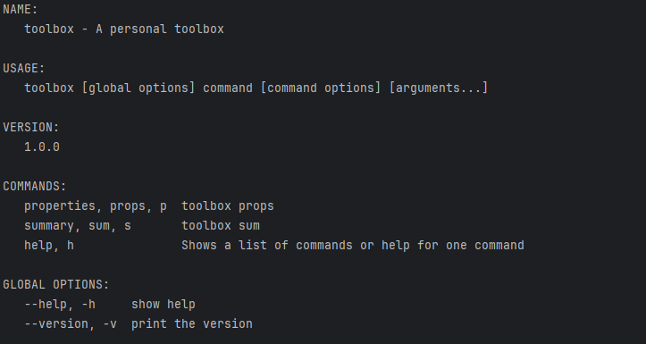

# Toolbox
A personal toolbox. 

## Usage
    toolbox -h

    
## Properties
### str2Unicode
    toolbox props -c "你好,世界 Hello world"
    ==========      Convert2Unicode  ==========
    \u4f60\u597d,\u4e16\u754c Hello world
### unicode2Str
    toolbox props -c "\u4f60\u597d,\u4e16\u754c Hello world"
    ==========      Convert2Str      ==========
    你好,世界 Hello world

## Hash
### Calculate file Hash
    toolbox sum -f /home/abc.txt

### Calculate str Hash
    toolbox sum -c "Hello world"
    algorithm        | hash值 
    md5              | 3e25960a79dbc69b674cd4ec67a72c62
    sha1             | 7b502c3a1f48c8609ae212cdfb639dee39673f5e
    crc32            | 10进制: 2346098258    |       16进制: 8bd69e52
    sha256           | 64ec88ca00b268e5ba1a35678a1b5316d212f4f366b2477232534a8aeca37f3c
    sha384           | 9203b0c4439fd1e6ae5878866337b7c532acd6d9260150c80318e8ab8c27ce330189f8df94fb890df1d298ff360627e1
    sha512           | b7f783baed8297f0db917462184ff4f08e69c2d5e5f79a942600f9725f58ce1f29c18139bf80b06c0fff2bdd34738452ecf40c488c22a7e3d80cdf6f9c1c0d47